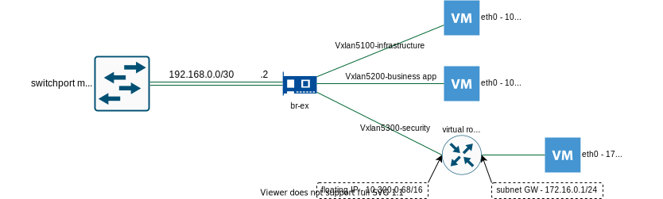

### 0. Description

This document describes example configuration of network equipment and 
OpenStack Neutron for linux bridge networking.


This setup assumes:

- On network equipment port or port-channel configured in access mode
- On Linux side configured linux bridge interface
- Vxlans originating from compute node, so for acceptable performance 
  it needs network card with Vxlan offloading.
- Vxlans VNIs starts from 5000, since max VLAN ID number can't exceed 4096


Example OpenStack network with linux bridge diagram:




### 1. Network equipment configuration


```
interface PortChannel0
 switchport mode access
 ip address 192.168.0.1 255.255.255.252         
       
```


### 2. OpenStack Neutron configuration


Linux bridge configuration

*Example with Ubuntu netplan*

```
network:
  version: 2
  renderer: networkd
  ethernets:
    ens3:
      dhcp4: no
      dhcp6: no
    ens4:
      dhcp4: no
      dhcp6: no
  bridges:
    br-ex:
      interfaces: [ens3,ens4]
      addresses: [192.168.0.2/30]
      gateway4: 192.168.0.1
      mtu: 1500
      nameservers:
        addresses: [8.8.8.8]
      dhcp4: no
      dhcp6: no
      parameters:
        stp: no

```


Ml2 plugin configuration (/etc/neutron/plugins/ml2/ml2_conf.ini)

```
[DEFAULT]


[ml2]
type_drivers = flat,vxlan
tenant_network_types = vxlan
mechanism_drivers = linuxbridge,l2population
extension_drivers = port_security


[ml2_type_flat]
flat_networks = provider


[ml2_type_vxlan]
vni_ranges = 5000:10000


[securitygroup]
enable_ipset = true


[agent]
extensions = fwaas_v2


[fwaas]
firewall_l2_driver = noop

```


Linux bridge configuration (/etc/neutron/plugins/ml2/linuxbridge_agent.ini)

```
[DEFAULT]


[agent]
prevent_arp_spoofing = true


[linux_bridge]
physical_interface_mappings = provider:br-ex


[securitygroup]
enable_security_group = true
firewall_driver = neutron.agent.linux.iptables_firewall.IptablesFirewallDriver

[vxlan]
enable_vxlan = true
local_ip = 192.168.0.2
l2_population = true

```


### 3. Create OpenStack networks


```
openstack network create --share --external
                         --provider-physical-network provider 
                         --provider-network-type flat PROVIDER1

openstack subnet create --subnet-range 10.64.10.0/24 --gateway 10.64.10.1 
                        --network PROVIDER1 
                        --allocation-pool start=10.64.10.200,end=10.64.10.220 
                        --dns-nameserver 8.8.8.8 PROVIDER1-v4

openstack network create NET1

openstack subnet create --subnet-range 172.16.1.0/24 --network NET1 
                        --dns-nameserver 8.8.8.8 SUBNET1

openstack router create BORDER

openstack router add subnet BORDER SUBNET1

openstack router set --external-gateway PROVIDER1 BORDER

```

