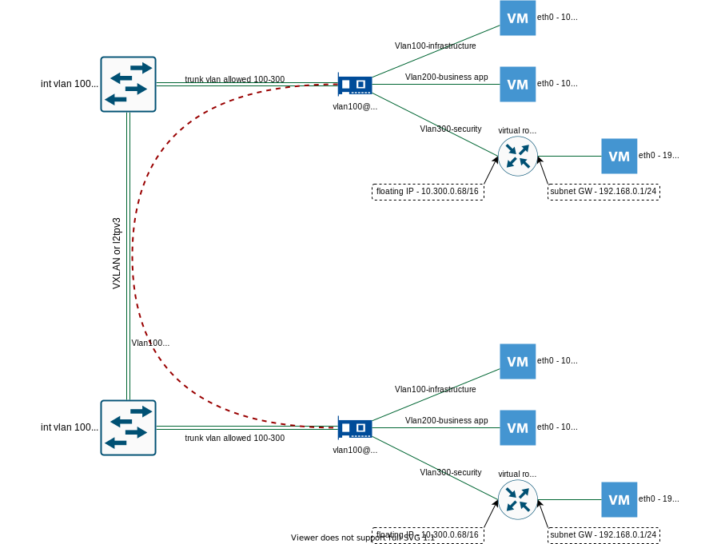

### 0. Description

This document describes example configuration of network equipment and 
OpenStack Neutron for network isolation with vlans between tenants
and l2tpv3 or VXLAN between network equipment in same datacenter or 
distributed between several.

This setup assumes:

- Between OpenStack node and network switch configure link aggregation (LAG). 
  From linux side - bond interface. From network switch - port-channel.
- Configure this link in trunk mode with allowance of featured data vlans IDs.
- In network switch create interface vlan for each vlan IDs and assign 
  IP address. It will serve as default gatateway for OpenStack network.
- If network equipment supports automatic configuration via ml2 plugin
  configure ml2 mechanics driver support instead.
- Vlans traffic between network switches are incapsulated in l2tpv3 or VXLAN tunnels 
  this allow to distribute L2 segments between two or more datacenters.
- Network traffic routing between vlans managed by network switches.
- When OpenStack administrator creates network, Neutron automatically creates 
  corresponding vlan interface over bond interface and sends tagget traffic 
  to network switch.
- From OpenStack side, administrator creates external network and assign it 
  to the project.
  Project administator create VMs and assign it to external network 
  (vlan 100 and 200 on diagram)  

  or  
  
  Create self-servise networks, virtual routes and use Floating IP mechanism
  to add access to VM from external network (vlan 300 on diagram).
  This scenario usefull when you have environment with several VMs and public access
  are required just by one of it.

  For example:  
    - VM with MariaDB database  
    - VM with Apache web server  
    - VM with loadbalancer    

  For communication between this VMs better to use private self-service network
  and assign public Floating IP only for load balancer.


Example OpenStack network with vlan network isolation and l2tpv3 or VXLAN for 
extending vlans over datacenters:




### 1. Network equipment configuration


*In this example cisco switch without ML2 plugin support*

```
interface PortChannel0
 switchport trunk allowed vlan 1,100-300,1002-1005
 switchport mode trunk
 no ip address
!         
interface Vlan100
 ip address 10.64.10.1 255.255.255.0
!         
interface Vlan200
 ip address 10.64.20.1 255.255.255.0
!                  
interface Vlan300
 ip address 10.64.30.1 255.255.255.0
       
```


### 2. OpenStack Neutron configuration


Linux bonding configuration

*Example with Ubuntu netplan*

*vlan30 - management interface*

```
network:
  version: 2
  renderer: networkd
  ethernets:
    ens3:
      dhcp4: no
      dhcp6: no
    ens4:
      dhcp4: no
      dhcp6: no
  bonds:
    bond-ex:
      interfaces: [ens3,ens4]
      dhcp4: no
      dhcp6: no
  vlans:
    vlan30:
      id: 30
      link: bond-ex
      addresses: [10.64.30.100/24]
      gateway4: 10.64.30.1
      nameservers:
        addresses: [8.8.8.8]
      dhcp4: no
      dhcp6: no

```


Ml2 plugin configuration (/etc/neutron/plugins/ml2/ml2_conf.ini)

```
[DEFAULT]


[ml2]
type_drivers = flat,vlan
tenant_network_types = vlan
mechanism_drivers = linuxbridge,l2population
extension_drivers = port_security


[ml2_type_flat]
flat_networks = provider


[ml2_type_vlan]
network_vlan_ranges = provider:100:300


[securitygroup]
enable_ipset = true


[agent]
extensions = fwaas_v2


[fwaas]
firewall_l2_driver = noop

```


Linux bridge configuration (/etc/neutron/plugins/ml2/linuxbridge_agent.ini)

```
[DEFAULT]


[agent]
prevent_arp_spoofing = true


[linux_bridge]
physical_interface_mappings = provider:bond-ex


[securitygroup]
enable_security_group = true
firewall_driver = neutron.agent.linux.iptables_firewall.IptablesFirewallDriver

```


### 3. Create OpenStack networks


```
openstack network create --share --external --provider-physical-network provider 
                         --provider-network-type vlan --provider-segment 100 infrastructure

openstack subnet create --network infrastructure
                        --allocation-pool start=10.64.100.10,end=10.64.100.254 
                        --no-dhcp --dns-nameserver 8.8.8.8 --gateway 10.64.100.1 
                        --subnet-range 10.64.100.0/24 infr-subnet

```

