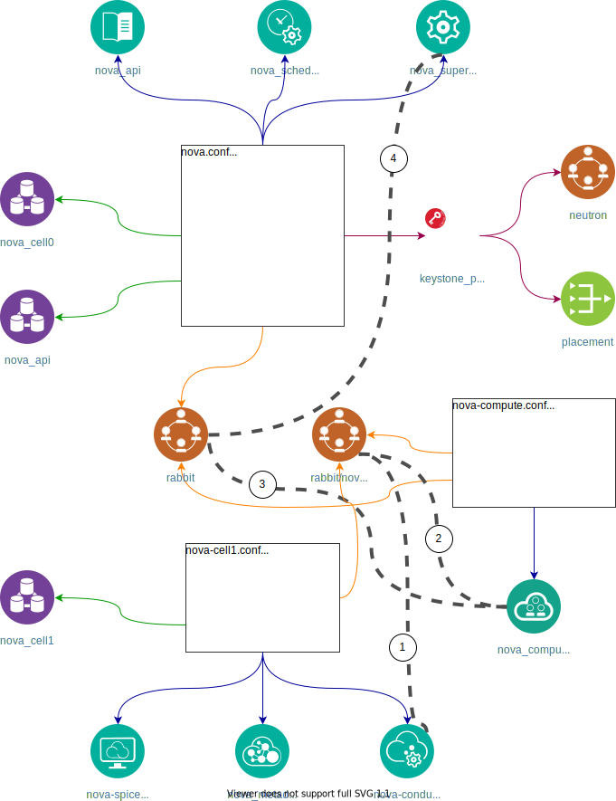

### 0. Description

Nova Cells allow to **_shard_** compute nodes in **_cells_** each with 
its own isolated database and message queue. This approach increase
Nova Compute resources isolation and cloud security. In large 
deployments, in addition it allow to shard resources, create 
separate/isolated failure domains, etc.

* Communication flow between Nova cell1 and Superconductor
* Reference between services and configuration files

