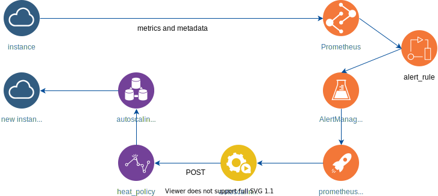

### 0. Description

This document describes example configuration of OpenStack Heat 
autoscaling with Prometheus as monitoring and alerting backend.

This setup assumes:

- Heat template creates autoscaling group with autoscaling policies
- Heat assign to instance metatags with information:
    * instance is a member of autoscaling group (prometheus_autoscaling = true)
    * instance project id 
    * instance stack name
    * instance stack id
- On instance are installed Prometheus Node Exporter
- Prometheus scrape this metatags and instance metrics (prometheus.yaml).
- Prometheus check alarm conditions (alert_rules.yaml)
- If condition occurs, trigger alarm to AlertManager (alertmanager.yaml)
- AlertManager run 'autoscaling.sh' script via prometheus-am-executor
- 'autoscaling.sh' script issued openstack authentification token,
  combine proper autoscaling policy web hook url from 'project id', 'stack id' 
  and 'stack name'. Send POST request with issued token on compiled url 
  to trigger autoscaling policy web hook signal
- OpenStack Heat engine receive signal and perfom appropriate action




### 1. Prometheus configuration

Prometheus scrape job and metrics relabeling config
Tags used in autoscaling:

* __meta_openstack_tag_prometheus_autoscaling
* __meta_openstack_tag_stack_id
* __meta_openstack_tag_project_id
* __meta_openstack_tag_stack_name

```
  - job_name: 'openstack_autoscaling'
    openstack_sd_configs:
      - identity_endpoint: http://127.0.0.1/identity
        username: admin
        password: alex
        project_name: Cloud
        domain_name: Default
        region: RegionUA
        role: instance
        port: 9100
  
    relabel_configs:
    - source_labels: [__meta_openstack_instance_name]
      target_label: instance
    - source_labels: [__meta_openstack_instance_status]
      target_label: status
    - source_labels: [__meta_openstack_instance_id]
      target_label: openstack_id  
    - source_labels: [__meta_openstack_tag_prometheus_autoscaling]
      action: keep
      regex: 'true'
    - source_labels: [__meta_openstack_tag_stack_id]
      target_label: tenant_stack_id  
    - source_labels: [__meta_openstack_tag_project_id]
      target_label: tenant_project_id
    - source_labels: [__meta_openstack_tag_stack_name]
      target_label: tenant_stack_name
```

Alert rule example.
Parameter 'severity' used in 'autoscaling.sh' script to distinguish scale up 
from scale down policy. Other parameters just passed instance metadata 
scraped by Prometheus to AlertManager.

```
groups:
  - name: High Network Utilization
    rules:
    - alert: HighBandwith
      expr: rate(node_network_receive_bytes_total{device="eth0"}[1m])/1024/1024 > 1.0
      for: 1m
      labels:
        severity: upscale
        tenant_stack_id: "{{ $labels.tenant_stack_id }}"
        tenant_project_id: "{{ $labels.tenant_project_id }}"
        tenant_stack_name: "{{ $labels.tenant_stack_name }}"
      annotations:
        summary: High instance network utilization alert to trigger Heat upscaling
```


### 2. AlertManager configuration

Receive alert from Prometheus and when firing condition occurs - pass it 
to prometheus-am-executor, which are listening on configured IP address and port.

```
global:
  resolve_timeout: 1m

route:
  group_by: ['alertname']
  group_wait: 10s
  group_interval: 10s
  repeat_interval: 10m
  receiver: 'web.hook'
  
receivers:
  - name: 'web.hook'
    webhook_configs:
    - url: 'http://127.0.0.1:39091/'
      send_resolved: true
```


### 3. Prometheus-am-executor configuration

Prometheus AlertManager can't execute shell commands. For this purpose are used 
prometheus-am-executor. It listens on configured IP address and port and when 
receives signal from AlertManager executes shell script with parameters passed 
by AlertManager.

Parameters passed from AlertManager can be used in shell script via 
'$AMX_ALERT_' variables. Full list of available variables can be found on 
prometheus-am-executor github page.

Autoscaling script example:

```
#!/bin/bash
#
# OpenStack Heat policy web-hook url structure:
# http://127.0.0.1/orchestration/v1/<project_id>/stacks/<stack_name>/<stack_id>/resources/<policy_name>/signal
#

if [[ "$AMX_STATUS" != "firing" ]]; then
    exit 0
fi

# Load Openstack credentials
source /opt/openstack.build/openrc

# issue token
token=$(openstack token issue -c id -f value)

# send upscale signal to OpenStack policy
if [[ "$AMX_ALERT_1_LABEL_severity" == "upscale" ]]; then

    url="http://127.0.0.1/orchestration/v1/$AMX_ALERT_1_LABEL_tenant_project_id/stacks/$AMX_ALERT_1_LABEL_tenant_stack_name/$AMX_ALERT_1_LABEL_tenant_stack_id/resources/scaleup_policy/signal"
    curl -s -H "X-Auth-Token: $token" -X POST -i -k $url

fi
```


### 4. Example Heat templates

Create autoscaling group and autoscaling policies. 
Gets project id, stack id and stack name parameters and pass it to instance template.

```
heat_template_version: 2018-08-31
description: Launch Dumb Debian instance in autoscaling group


resources:

  scaleup_policy:
    type: OS::Heat::ScalingPolicy
    properties:
      adjustment_type: change_in_capacity
      auto_scaling_group_id: { get_resource: autoscaling_group }
      cooldown: 60
      scaling_adjustment: 1

  scaledown_policy:
    type: OS::Heat::ScalingPolicy
    properties:
      adjustment_type: change_in_capacity
      auto_scaling_group_id: { get_resource: autoscaling_group }
      cooldown: 60
      scaling_adjustment: -1

  autoscaling_group:
    type: OS::Heat::AutoScalingGroup
    properties:
      min_size: 1
      max_size: 3
      resource:      
        type: prometheus_client.yaml
        properties:
          project_id: { get_param: "OS::project_id" }
          stack_id: { get_param: "OS::stack_id" }
          stack_name: { get_param: "OS::stack_name" }
```

In instance autoscaling template additions to normal instance creation:

* get metadata throught Heat parameters and assign it to instance.
* install and run Prometheus Node Exporter
* add security group to allow Prometheus Node Exporter traffic

```
heat_template_version: 2018-08-31
description: Launch a Debian instance with Prometheus node exporter service.
             Dumb instance for testing prometheus monitoring purpose only.
             This all-in-one template without any depencies.

parameters:
  net_name:
    type: string
    default: infrastructure
  subnet_name:
    type: string
    default: infr-subnet  
  image:
    type: string
    default: debian-10.3.0-amd64
  flavor:
    type: string
    default: db.small
  autoscaling:
    type: string
    default: 'true'
  project_id:
    type: string      
  stack_id:
    type: string      
  stack_name:
    type: string      


resources:
  port:
    type: OS::Neutron::Port
    properties:
      network: { get_param: net_name }
      security_groups: [ basic, prometheus ]
      fixed_ips: 
      - subnet_id: { get_param: subnet_name }

  host:
    type: OS::Nova::Server
    properties:
      image: { get_param: image}
      flavor: { get_param: flavor}
      metadata: { "prometheus_autoscaling": { get_param: autoscaling},
                  "stack_id": { get_param: stack_id },
                  "project_id": { get_param: project_id },
                  "stack_name": { get_param: stack_name } }
      networks:
        - port: { get_resource: port }
      user_data_format: RAW
      user_data: |
        #cloud-config
        preserve_hostname: False
        hostname: client
        fqdn: client.local

        users:
        - default
        - name: alex
          groups: sudo
          shell: /bin/bash
          lock-passwd: false
          passwd: $6$saltsalt$OpvVlYPY6YYXhosOAmr.a7PTpqaXv75xsI0bYfRKG3FGAOBgD32Mz/WXe.YKIKWhBVhh4DeNh281JyPVIBlKD0
          sudo: ['ALL=(ALL) NOPASSWD:ALL']
        ssh_pwauth: true

        package_update: true

        packages:
        - openssh-server

        write_files:
        - content: |
            [Unit]
            Description=Node Exporter
            Wants=network-online.target
            After=network-online.target

            [Service]
            User=prometheus
            Type=simple
            ExecStart=/opt/prometheus/node_exporter

            [Install]
            WantedBy=multi-user.target
          path: /lib/systemd/system/node_exporter.service
          owner: root:root

        runcmd:
        - grep prometheus /etc/passwd > /dev/null || useradd -d /opt/prometheus -m prometheus
        - cd /opt/prometheus
        - wget https://github.com/prometheus/node_exporter/releases/download/v0.18.1/node_exporter-0.18.1.linux-amd64.tar.gz
        - tar xf node_exporter-0.18.1.linux-amd64.tar.gz --strip 1
        - systemctl daemon-reload
        - systemctl enable node_exporter
        - systemctl start node_exporter

```

